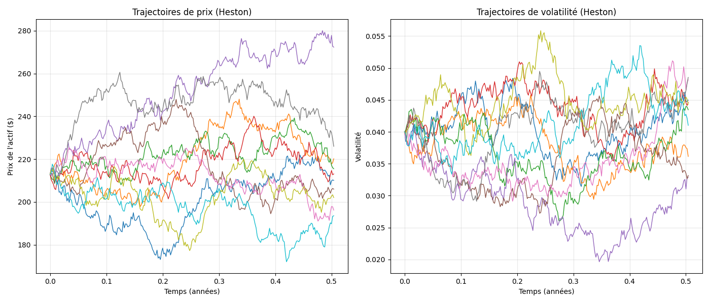

# Option Pricing Project

Ce projet permet de calculer le prix d'une option financière en utilisant plusieurs méthodes :  

- **Formule de Black-Scholes** : Modèle analytique pour les options européennes.  
- **Simulation de Monte Carlo** : Estimation numérique du prix de l'option en simulant l'évolution du sous-jacent.  
- **Modèle de Heston** : Modélisation de la volatilité stochastique pour améliorer la précision du pricing.  
- **Arbre Binomial** : Approche discrète modélisant les évolutions du prix de l'actif sous-jacent.  

Le projet inclut également une comparaison avec les prix du marché ainsi que le calcul des grecques (delta, gamma, theta, vega, rho).  
Pour explorer la partie théorique, vous pouvez consulter le fichier [Report.ipynb](Report.ipynb).

## Méthodes de Pricing

- **Formule de Black-Scholes** : Calcul exact du prix d'une option européenne basé sur un modèle analytique.  
- **Simulation de Monte Carlo** : Approche numérique utilisant des simulations pour estimer le prix de l'option.  
- **Modèle de Heston** : Extension de Black-Scholes permettant d'introduire une volatilité stochastique, plus réaliste pour les marchés financiers.  
- **Arbre Binomial** : Méthode discrète permettant d'estimer le prix d'une option en modélisant les évolutions de l'actif sous-jacent à chaque période.  

## Optimisation des Performances

Le projet utilise **NumPy** pour les calculs numériques et **Numba** pour optimiser la simulation de Monte Carlo. **Numba** permet d'accélérer les calculs en compilant les fonctions Python en code machine, ce qui entraîne une réduction significative du temps d'exécution des simulations, en particulier pour des simulations avec un grand nombre de trajectoires.

### Estimation des gains de performance

Lors de l'implémentation initiale sans optimisation, le calcul pour 1 000 000 de simulations prenait environ **40 secondes**.  
Après l'optimisation avec **Numba**, le temps de calcul a été réduit à environ **10 secondes**.  

Cette amélioration a un impact direct sur la vitesse de calcul des prix d'option, permettant d'effectuer des simulations avec une grande précision en un temps bien plus court, ce qui est essentiel pour des applications en temps réel ou des simulations nécessitant un grand nombre de répétitions.

## Modèle de Heston

Le modèle de Heston permet d'améliorer la précision du pricing en tenant compte de la **volatilité stochastique**. Contrairement au modèle de Black-Scholes, où la volatilité est constante, Heston modélise son évolution avec un processus de diffusion.  

Les paramètres principaux du modèle sont :  
- **κ (kappa)** : Vitesse de retour à la moyenne de la volatilité.  
- **θ (theta)** : Niveau moyen de la volatilité.  
- **ξ (xi)** : Volatilité de la volatilité.  
- **ρ (rho)** : Corrélation entre l’évolution du sous-jacent et celle de la volatilité.  
- **V₀ (v0)** : Volatilité initiale.  

Le modèle de Heston est implémenté pour les options européennes et permet d'obtenir une meilleure précision lorsque la volatilité du marché varie significativement.

## Simulation de Monte Carlo

La simulation de Monte Carlo est utilisée pour approximer le prix d'une option en générant plusieurs trajectoires du prix de l'actif sous-jacent.  
Chaque trajectoire est calculée en utilisant une marche aléatoire basée sur le processus de Black-Scholes ou de Heston.  

### Paramètres de la simulation :
- **Nombre de simulations** : Définit combien de trajectoires du sous-jacent seront simulées.  
- **Nombre de pas de temps** : Indique la granularité temporelle de chaque trajectoire.  

L'algorithme utilise **Numba** pour optimiser l'exécution, rendant le calcul plus rapide et efficace.

## Résultats du Pricing

### Légende du graphique :
Le graphique ci-dessus montre une comparaison des prix des options obtenus à partir des différentes méthodes de pricing :  
- **Black-Scholes**  
- **Monte Carlo**  
- **Modèle de Heston**  
- **Arbre Binomial**  
- **Prix du marché** (référence)  

Ces comparaisons permettent d’évaluer la précision de chaque modèle et d’observer les écarts avec le prix du marché.
